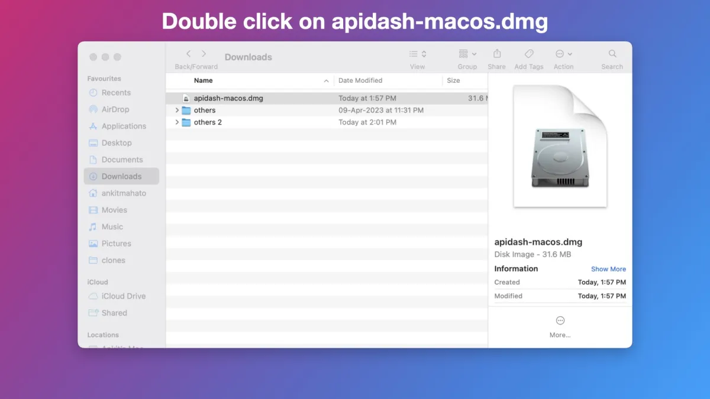
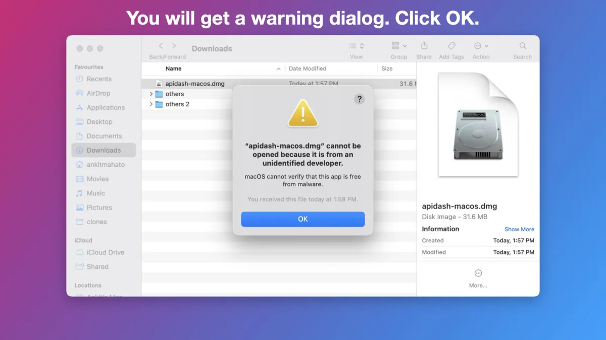
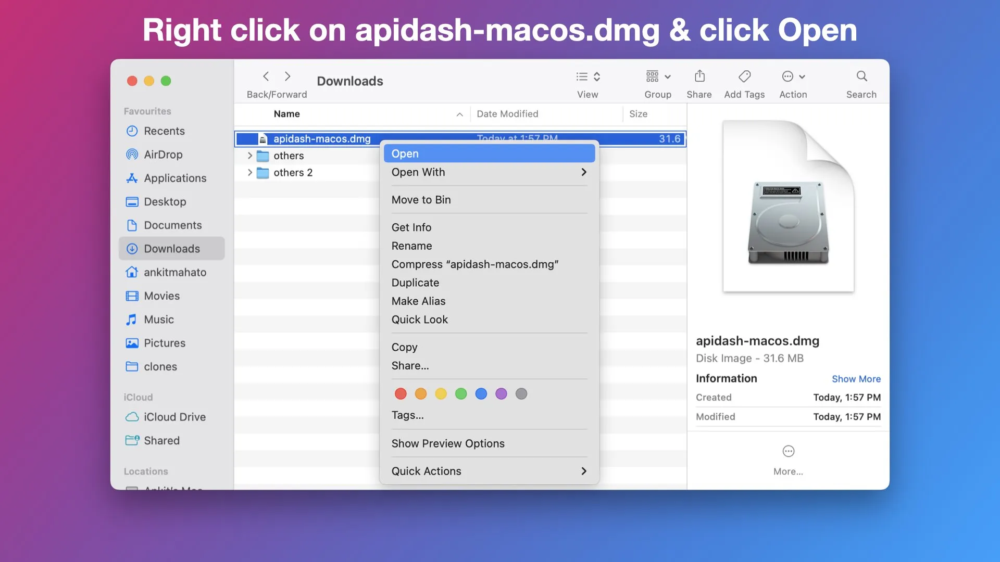
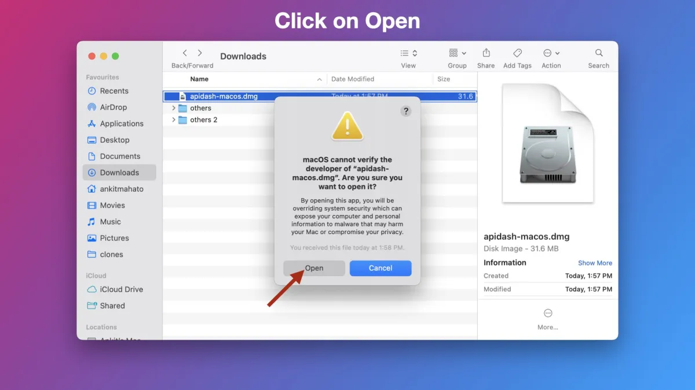
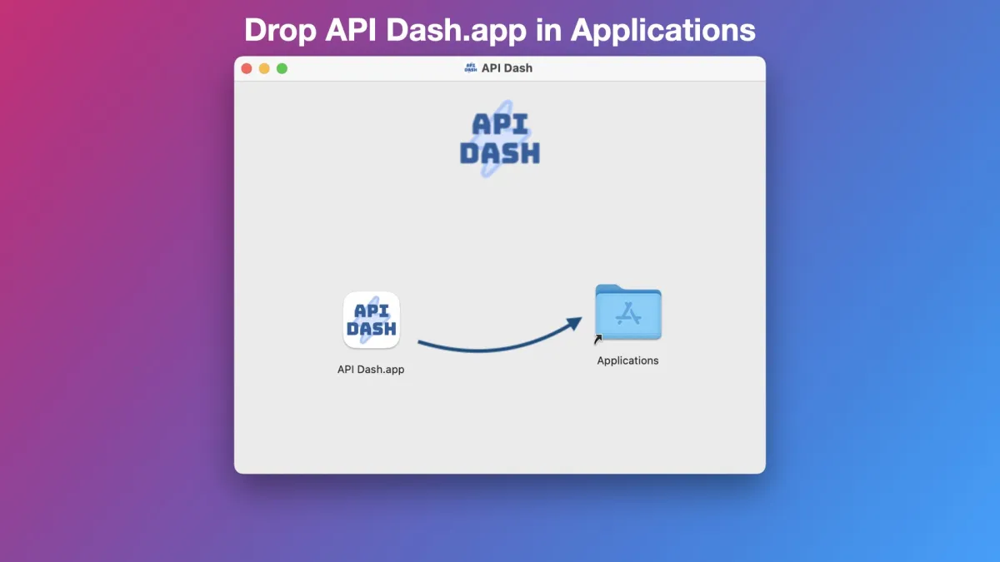
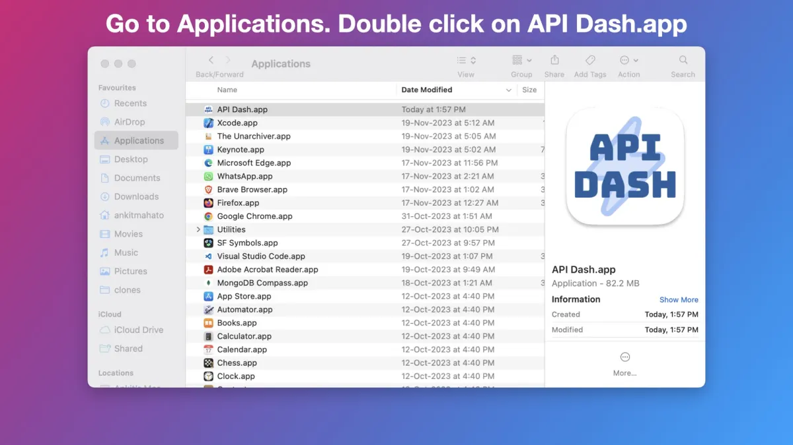
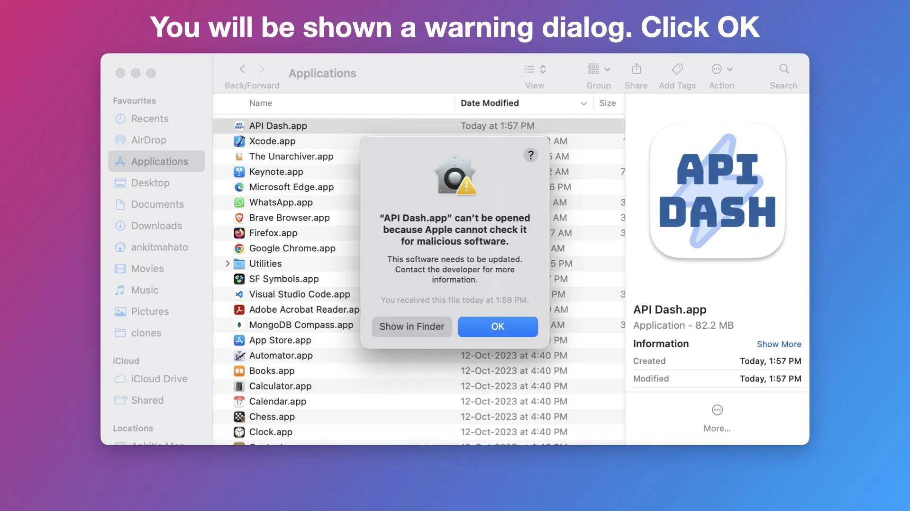
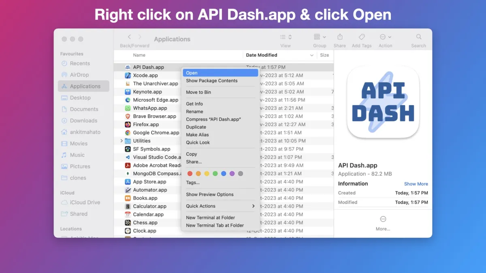
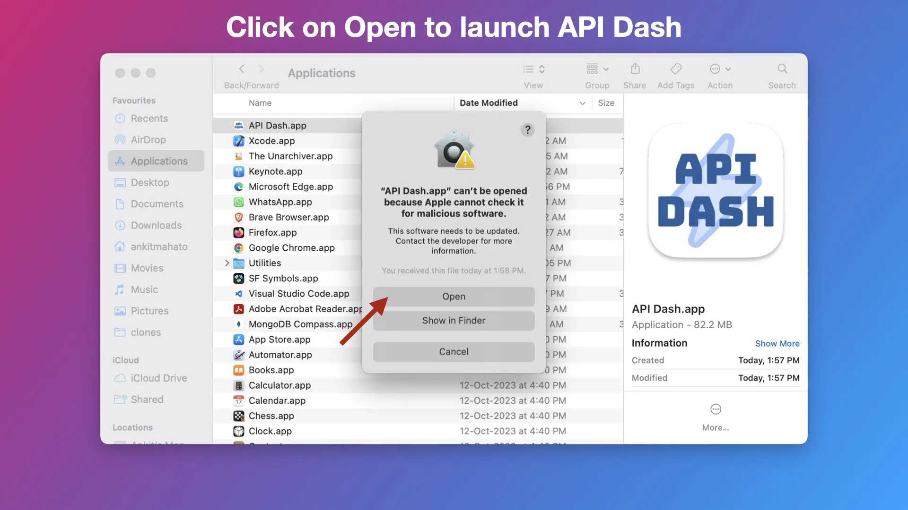

## macOS

Download the latest macOS Installer (Universal - Intel and Apple Silicon) from [here](https://github.com/muzipiao/aibox/releases/latest)

**As this app is distributed outside the App Store you have to follow the following instructions to setup and run it only for the first time.**

This process has to be followed only once and from the next time you can directly launch the AIBox App from the Launchpad.

## Refer to API Dash

You can refer to the video given below which shows the steps to install and run AIBox on macOS.

https://user-images.githubusercontent.com/1382619/227956871-87376f18-d80f-4a53-9456-cb724f8149c7.mp4