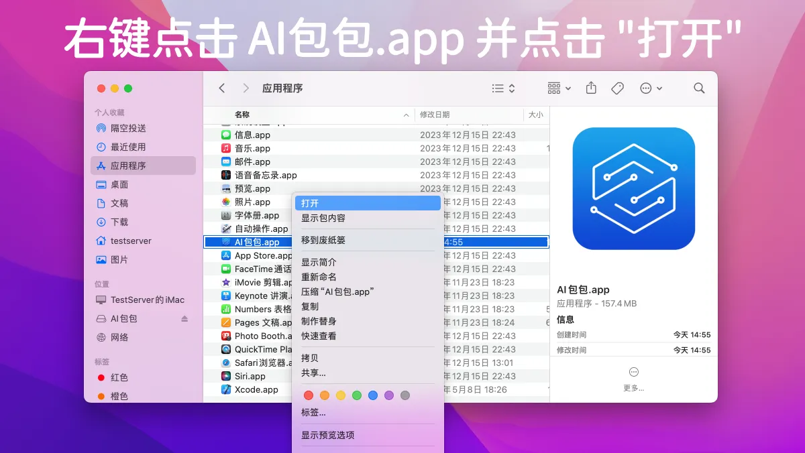

## macOS

从[此处](https://github.com/muzipiao/aibox/releases/latest)下载最新的 macOS 安装程序（Intel 和 Apple Silicon 通用）。

**由于此应用程序是在 App Store 之外分发的，因此您必须按照以下说明进行设置并仅在首次运行它。**

此过程 **只需执行一次**，下次您就可以直接从 **启动台** 启动 **AI包包** 应用程序。

## 可参阅 API Dash 安装视频

您可以参考下面给出的视频，其中展示了在 macOS 上 App Store 之外分发的应用，安装和运行的步骤。

https://user-images.githubusercontent.com/1382619/227956871-87376f18-d80f-4a53-9456-cb724f8149c7.mp4